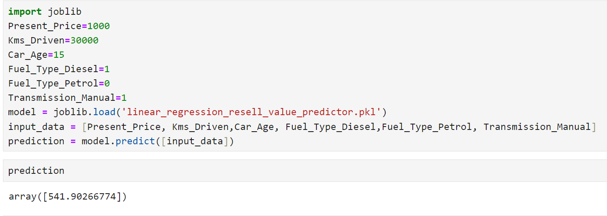

# Car Resell Value Predictor

## Project Overview
This project aims to predict the resell value of cars based on various features such as present price, kilometers driven, fuel type, and transmission type.

## Demo Images


### Selling Price vs. Present Price

### Prediction of Selling Price


## How to Run
1. **Install Jupyter Notebook** (if not already installed):

    ```bash
    pip install notebook
    ```
2. **Launch the Jupyter Notebook**:

    ```bash
    jupyter notebook car_resale_prediction.ipynb
    ```
3. **Execute the Notebook Cells**
## License
This project is licensed under the MIT License.
